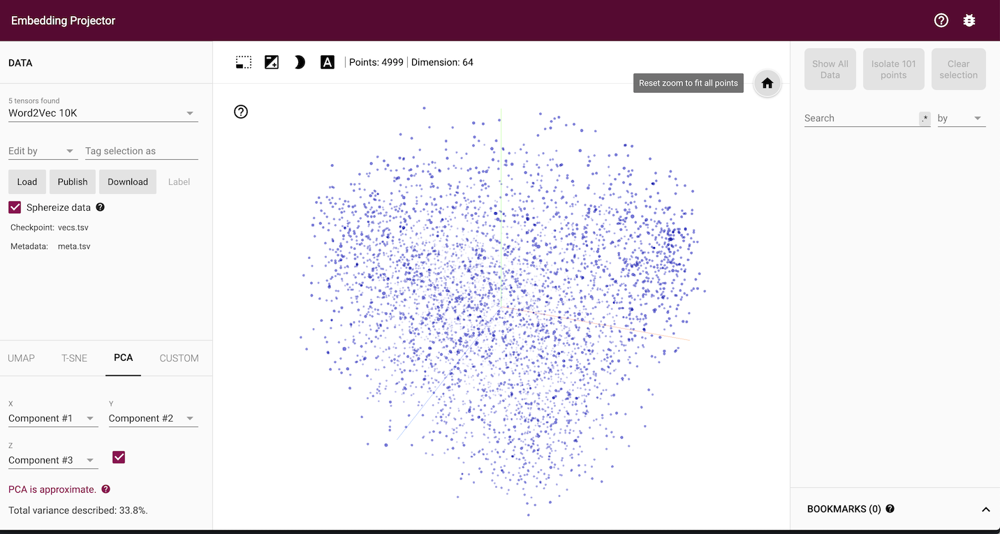

# News Class

  

Natural Language Processing with Tensor Flow for news classification  

This is the repository for a machine learning model developed as part of the Udacity's Machine learning engineering nano degree.

The main purpose of the model is to help an imaginary company to solve the next business problem:

## Project background
A company is using commercial software for this classifying news mentioning the brand, both on the Internet and social networks. Results are weak, so they wanted to test the possibilities of an in house development. The problem is that de the Marketing department doesn't want to invest in manual manipulation of the mentions, as that's what the PR team is obligated to do now.

We are asked to demonstrate that an efficient model could be trained without too many efforts in tagging results manually, even for the creation of the initial training dataset. If results are good and automation is possible, we will then implement the solution in the production environment.

## Project goals
- Design, test and evaluate at least four different models for document classification
- Demonstrate easiness in the application of models to business tasks
- Demonstrate a minimum level of accuracy
- Select a model for implementation
- To test and evaluate our models, we will use a labeled data dataset so we can classify each text entry in one of these categories: business, entertainment, politics, sport, tech.

## Data

We will use the **BBC news dataset**, which consists of [2225 documents from the BBC news website](http://mlg.ucd.ie/datasets/bbc.html) corresponding to stories in five topical areas from 2004-2005. Class Labels: 5 (business, entertainment, politics, sport, tech)

This dataset is publicly available and relatively small, meaning if our results meet the company expectations, we will demonstrate that it could be possible, even with a small number of pre-classified documents.

## Libraries

The project is developed using TensorFlow as Deeplearning framework. The complete list of libraries used is:

* [TensorFlow](https://github.com/tensorflow/tensorflow)
* [Pandas](https://github.com/pandas-dev/pandas)
* [Numpy](https://github.com/numpy/numpy)
* [NLTK](https://github.com/nltk/nltk)
* [Matplotlib](https://github.com/matplotlib/matplotlib)

For prototyping solution we used:
* [Tweepy](https://github.com/tweepy/tweepy)
* [BeautifulSoup](https://pypi.org/project/beautifulsoup4/)

Please note that credentials to connect Twitter API have been renewed before making it public. You will have to substitute those parameters with your own credentials to run this software.  

## Main conclusions

- Combining model architectures with proven success in text classification with pre-trained word-embeddings seems to be good enough to approach our project tasks with the minimum accuracy expected by our stakeholders.

- Even considering the small number of samples used in the training data set, and the generic classes used in the ground truth provided, the sum of LSTMs, convolutions, and Glove, produced the desired result.

- We recommend continuing with a more elaborated implementation, using at list the architecture defined by models 3 and 4.

Some manual labeling would be needed though, but we suggest to put our focus on:
- Keep the dataset balanced between cases Design more concrete, more relevant labels
- Produce a similar number of cases for training and validation
- Combine the training dataset with pre-trained embeddings

## List of models and techniques  

- [LSTM (Long Short-Term Memory)](https://www.tensorflow.org/api_docs/python/tf/keras/layers/LSTM)
- [CONV1D and MaxPool1D](https://www.tensorflow.org/api_docs/python/tf/keras/layers/Conv1D)
- [Word Embeddings- Glove](https://nlp.stanford.edu/projects/glove/)

  
